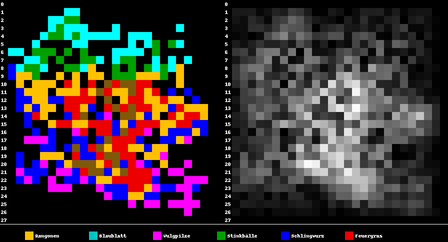
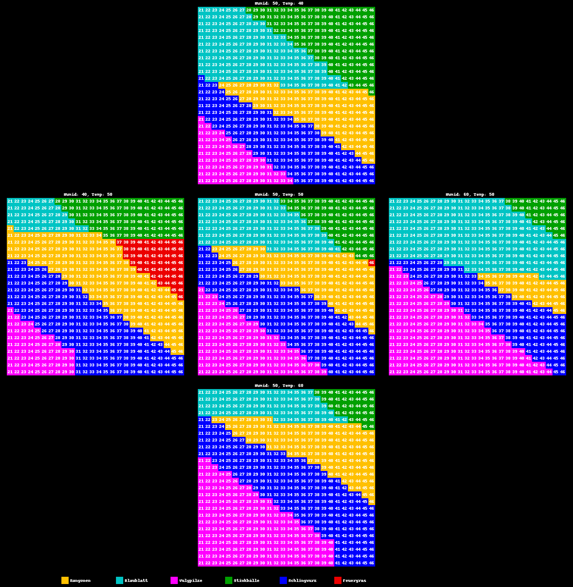

Höhenreliefs und Karten
=======================

Wie in [speicherstand.md] beschrieben, wird die Pflanzenverteilung bestimmt über die Temperatur, Feuchtigkeit, Höhe des Teils und die Y-Koordinate. Die Karte und das dazugehörige Höhenrelief sind folgend dargestellt. Im Relief sind hohe Felder heller dargestellt.

Ich habe eine bisschen mit den Parametern experimentiert und Temperatur und Feuchtigkeit jeweils um 10 Einheiten verändert.

Feuchtigkeit (Humid) und Temperatur sind jeweils angegeben. Die Geländehöhe steht auf dem jeweiligen Feld. Es ist ein Zusammenhang zwischen den Parametern und der Pflanze auf dem Feld zu sehen, aber mir sind die Details noch nicht klar.
